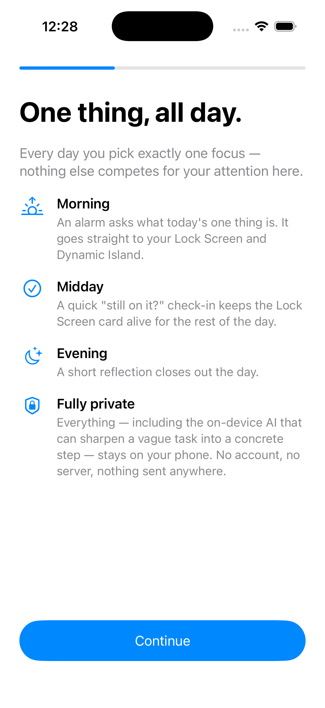
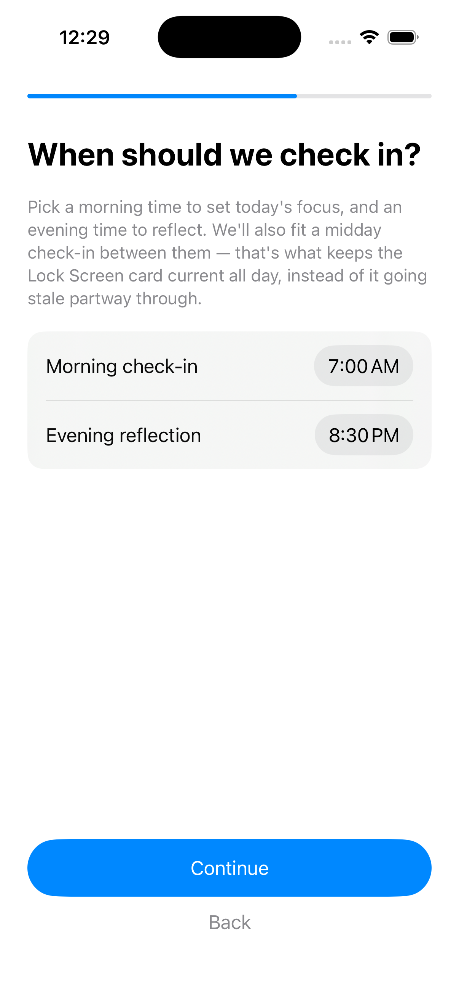
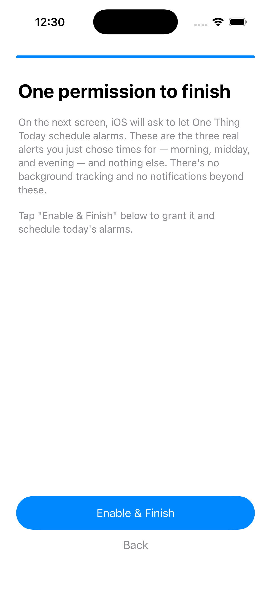
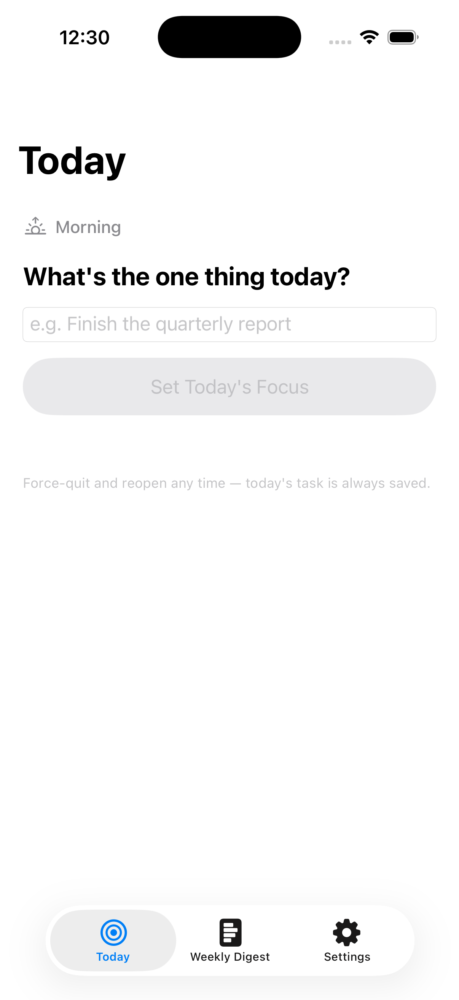
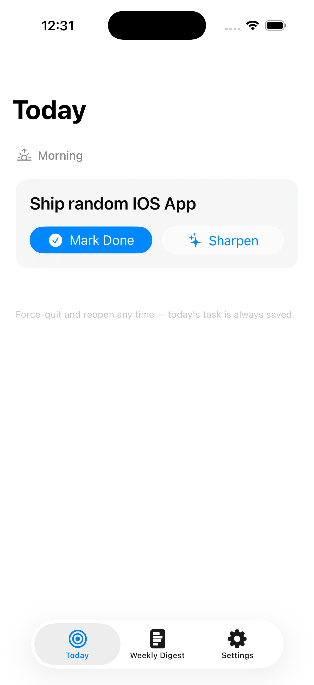
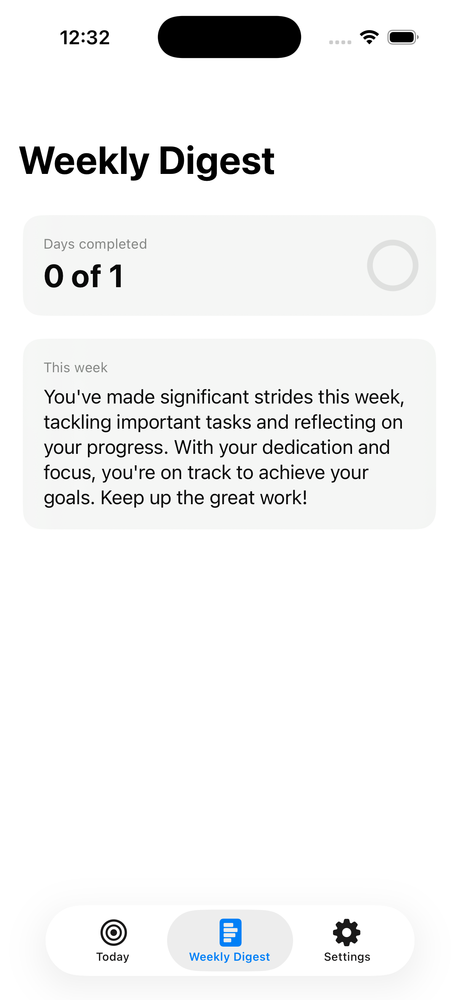
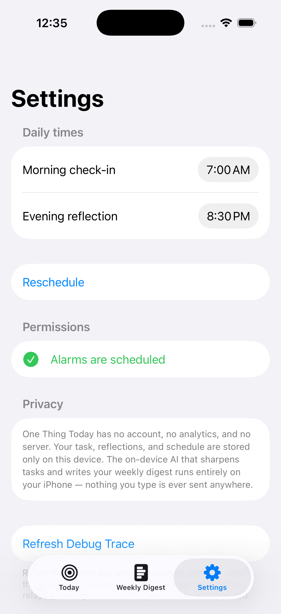

# One Thing Today

A single-purpose daily-focus iOS app.

## What's here right now

`OneThingTodayKit/` — a local Swift package, Clean-Architecture style:

- **OneThingTodayDomain** — entities, use cases, repository protocols.
  Pure Swift, no Apple frameworks. Phase 0 + Phase 1, done and tested.
- **OneThingTodayData** — SwiftData persistence (Phase 2), AlarmKit
  scheduling (Phase 3), the ActivityKit-backed Live Activity + relay
  engine (Phase 4), and the on-device Foundation Models AI service
  (Phase 5).

`OneThingToday/` — the app target: onboarding, and the Today / Weekly
Digest / Settings screens, each with its own `@Observable` view model,
wired up by `AppContainer` (the composition root). `OneThingTodayWidget/`
— the widget extension target: the Live Activity's Lock Screen card and
Dynamic Island (compact/minimal/expanded). Both are generated from
`project.yml` via `xcodegen generate`.

## Screenshots

Captured on a real iOS 26.5 simulator run — including a genuine on-device
Foundation Models response in the Weekly Digest shot below, not a mock.

<table>
<tr>
<th>Onboarding</th><th>Times</th><th>Permission</th>
</tr>
<tr>
<td></td>
<td></td>
<td></td>
</tr>
<tr>
<th>Today (empty)</th><th>Today (active task)</th><th>Weekly Digest</th><th>Settings</th>
</tr>
<tr>
<td></td>
<td></td>
<td></td>
<td></td>
</tr>
</table>

## Try it right now

Whole app + widget extension, in Xcode:

```
xcodegen generate   # regenerate OneThingToday.xcodeproj after editing project.yml
open OneThingToday.xcodeproj
```

Build/run the `OneThingToday` scheme on an iOS 26+ simulator or device.

Domain-only tests (no device needed, but run via Xcode/xcodebuild against
an iOS Simulator destination — `OneThingTodayData` now imports AlarmKit +
ActivityKit, so the package is iOS-only and a plain `swift test` on macOS
will fail on Foundation availability, not a real bug):

```
cd OneThingTodayKit
xcodebuild test -scheme OneThingTodayKit-Package -destination 'platform=iOS Simulator,name=iPhone 17 Pro'
```

## What's next

Phase 7 (polish & App Store prep) is in progress. Done so far: a real app
icon (`OneThingToday/Assets.xcassets/AppIcon.appiconset`), a distinct "no
history yet" empty state on the Weekly Digest screen instead of a wasted
on-device model call on a brand-new user's first day, and a fix for a real
onboarding trap — declining the AlarmKit permission used to leave a user
stuck on the permission screen forever (AlarmKit denial can only be reversed
from the iOS Settings app, not by re-prompting), so onboarding now offers
"Continue Without Reminders"; Settings shows the same denied state with a
direct "Open Settings" button. A second real bug turned up live-testing the
walkthrough for the screenshots below: Settings always claimed "alarms
aren't scheduled yet" on open even right after onboarding scheduled them,
since it never read back any persisted state — fixed with a small
`UserDefaults` flag both onboarding and Settings write on success. App Store
screenshots (below) are done. Monetization (the plan's optional StoreKit
gate for the digest) is deliberately skipped for v1. Still open: the Privacy
Nutrition Label (answered "data not collected" across the board in App Store
Connect — nothing in this app leaves the device).

Everything before Phase 7 (domain layer, persistence, AlarmKit scheduling,
the Live Activity relay engine, on-device Foundation Models, and the
onboarding/Today/Weekly Digest/Settings screens) is built and, as of this
pass, actually verified with `xcodebuild` against a real iOS 26.5 simulator
— both the app+widget build and the full `OneThingTodayKit` domain test
suite (16 tests) pass.
